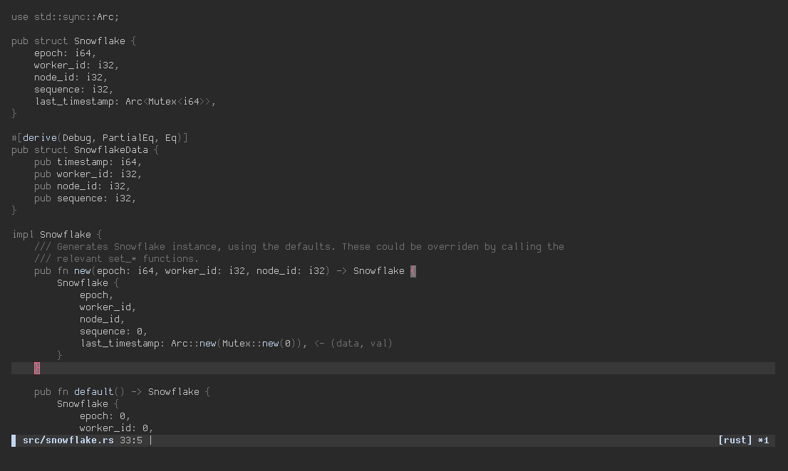

<div align="center">

# Avalanche

> Minimal soothing neovim colorscheme

</div>



Avalanche is a colorscheme with shades of grey and few accent colors.
Its purpose is to let the developers focus on the code itself by highlighting only the necessary parts,
instead of getting distracted by their fancy colorscheme.

It's mostly only shades of grey and one main accent color, other accents are only used when it's necessary
to make a difference (e.g diff files).

**This colorscheme requires neovim 0.7+.**

## Disclaimer
As of now, the shades of grey might be hard to read/differentiate.
Please do open an issue/PR if you find it hard to read.

That being said, the 'day' variant is currently unimplemented.

## Usage
### Configuring avalanche

```lua
require("avalanche").setup {
    variant = "night", -- night | day
    transparent = false, -- true | false
    color_overrides = {}, -- any color in colors.lua
}
```

### Applying avalanche

Vimscript:
```vim
colorscheme avalanche
```

Lua:
```lua
require("avalanche").apply()
```

Note that lua version is a wrapper around `colorscheme avalanche`.

While this may make you think that avalanche supports Vim, it does not.
Avalanche is made with lua and neovim-specific functions.

## Colors
- `bg` - Background
- `fg` - Foreground
- `light_bg` - Selection
- `coal` - UI, NonText
- `graphite` - UI, Rare syntax
- `ash` - Main grey, UI, String, etc.
- `accent` - Accent, function names, etc.
- `accent_bg` - Menu selection
- `snow` - Builtin functions
- `red` - Errors, Diff Delete
- `red_bg` - Errors, Diff Delete


## Shoutouts
- Original colors from [limestone](https://github.com/tsbohc/.garden/blob/dee6f9565fc13925e5e3a5b7906b0c518517461e/tmp/limestone_old.lua)
- Core design from [sakura.nvim](https://github.com/numToStr/Sakura.nvim)
